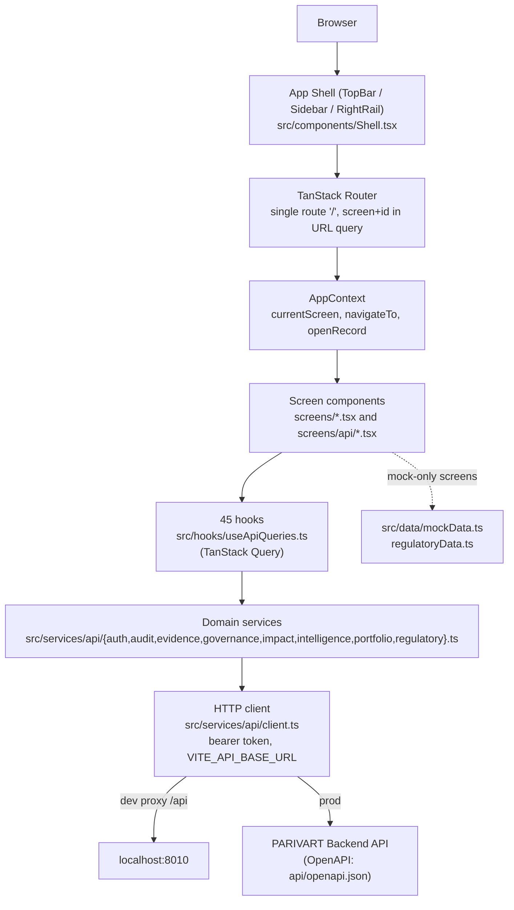

# 01 — Frontend Architecture

Evidence: `package.json`, `vite.config.ts`, `tsconfig.json`, `src/routes/*`, `src/context/*`, `src/services/api/*`, `src/hooks/useApiQueries.ts`. All version numbers VERIFIED by reading `package.json` directly.

## Framework and major libraries (verified versions)

| Library | Version | Role |
|---|---|---|
| react / react-dom | 19.2.0 | UI runtime |
| @tanstack/react-router | 1.168.25 | Client routing |
| @tanstack/react-start | 1.167.50 | SSR meta-framework (file-based route in `src/routes/`, server entry `src/server.ts`) |
| @tanstack/react-query | 5.83.0 | Server-state cache, used via `useApiQueries.ts` |
| tailwindcss | 4.2.1 (+`@tailwindcss/vite`) | Utility CSS, consumes the token layer in `src/styles.css` |
| Radix UI (full primitive set) + shadcn-style wrappers in `src/components/ui/` | varies | Accessible component primitives |
| react-hook-form + zod + @hookform/resolvers | 7.x / latest / 5.2.2 | Form state + schema validation (dialogs: RaiseAction, RecordDecision, AttachEvidence, DocumentUpload) |
| vite | 7.3.1 (wrapped by `@lovable.dev/vite-tanstack-config`) | Build/dev server |
| vitest | 5.0.2 | Test runner |
| typescript | 5.8.3, strict mode | Type safety |
| openapi-typescript | 7.13.0 | Generates `src/services/api/schema.d.ts` from `api/openapi.json` |
| @cloudflare/vite-plugin | 1.25.5 | Cloudflare Worker SSR build target |

## Entry points

- `src/routes/__root.tsx` — root route: `QueryClientProvider`, global `<HeadContent>`/`<Scripts>`, 404/error boundaries, imports `../styles.css`.
- `src/routes/index.tsx` — the single application route (`/`). Wraps `AuthProvider` → `ThemeProvider` → `AppProvider` → `Shell`. Comment in this file (verbatim, VERIFIED) explains the design choice:
  > "The shell switches screens by state rather than by route... Putting the pair in the query string gives every screen a shareable address and makes Back, Forward and Reload behave, without splitting a 30-screen shell into 30 file routes."
- `src/server.ts` — SSR/Worker server entry (used by both the TanStack Start SSR build and the Cloudflare Worker build per `wrangler.jsonc`).

## Routing and screen selection

Not file-based per screen. One TanStack Start route validates two query params (`screen`, `id`) against a runtime-checked `ScreenId` union (`isScreenId()` in `src/context/AppContext.tsx`) and falls back to `"dashboard"` for an invalid/missing value. `AppContext.go(screen, id)` is the single writer of both URL params; `navigateTo`/`openRecord` are thin wrappers around it. This means:
- Deep links, Back/Forward, and reload work correctly (VERIFIED by reading the routing code and its inline rationale comment).
- There is only one real HTTP route (`/`) besides the 404 fallback — screen-level code splitting via dynamic `import()` is NOT currently used (see bundle-size warning in [07](./07-testing-and-quality-assurance.md)).

## Component architecture

- `src/components/Shell.tsx` + `src/components/shell/{TopBar,Sidebar,RightRail}.tsx` — app chrome, present on every screen.
- `src/components/screens/*.tsx` — 17 top-level screen components, further split into:
  - `src/components/screens/api/*.tsx` (24 files) — screens and dialogs wired to live API hooks only (VERIFIED, see [04](./04-complete-screen-and-component-inventory.md)).
  - Remaining top-level screens — mix of live (`ReportDetailScreen`, `ReportGenerateScreen`, `ReportListScreen`, `Dashboard`) and mock-only (the other 12).
- `src/components/shared/*` — cross-screen primitives: `ApiState`, `Atoms`, `Badge`, `Button`, `Card`, `DataTable`, `Drawer`, `Filters`, `Logo`, `Page`, `Panel`, `States`, `ToastContainer`.
- `src/components/ui/*` — shadcn/Radix-wrapped low-level primitives (accordion, dialog, sidebar, chart, etc.), consumed by both `shared/` and screen components.
- `src/components/icons/` — `AppIcon` + `IconButton` + an icon registry (single source of truth for icon usage, implied by directory name; not individually audited file-by-file here).

## Shared components and design primitives

`shared/ApiState.tsx` and `shared/States.tsx` standardize loading/empty/error rendering for API-backed screens (name strongly implies this; confirmed by their use across `screens/api/*` import lists during the screen-classification pass). `shared/DataTable.tsx` and `shared/Panel.tsx` are the recurring list/detail layout primitives referenced across nearly every `screens/api/*` file.

## State management and data fetching

- Global/cross-cutting state: three React contexts — `AppContext` (current screen/record, navigation, demo-clock/action-log concerns), `AuthContext` (token lifecycle, 401 handling), `ThemeContext` (light/dark, SSR-safe since sidebar/theme defaults account for first paint before hydration per code comments).
- Server state: TanStack Query exclusively, via 45 typed hooks in `src/hooks/useApiQueries.ts` (VERIFIED by `grep` — full list in [06](./06-api-integration-and-data-flow.md)). No other data-fetching library (no SWR, no Apollo) is present.
- Local UI state: component-local `useState`/`react-hook-form`, no Redux/Zustand/Jotai found in `package.json`.

## API client architecture

See [06-api-integration-and-data-flow.md](./06-api-integration-and-data-flow.md) for full detail. Summary: single client module `src/services/api/client.ts`, env-driven base URL (`VITE_API_BASE_URL`), typed via generated `schema.d.ts`, domain service modules (`auth.ts`, `audit.ts`, `evidence.ts`, `governance.ts`, `impact.ts`, `intelligence.ts`, `portfolio.ts`, `regulatory.ts`) each exposing typed functions that `useApiQueries.ts` wraps in `useQuery`/`useMutation`.

## Authentication and session handling

Bearer-token model (OpenAPI confirms `OAuth2PasswordBearer`, `tokenUrl=/api/v1/auth/login`, VERIFIED by reading `api/openapi.json` paths list). Token held in an in-memory module variable plus `sessionStorage` (key `parivart.access-token`) for reload survival — deliberately not `localStorage` (narrower XSS exposure window, per code comment in `client.ts`). A single global 401 handler (`setUnauthorizedHandler`) clears auth and redirects to sign-in. `.env.example` documents a `VITE_DEMO_OPEN_SIGNIN` flag: when true, an unrecognized email auto-registers a new (empty) organization instead of being rejected — a demo convenience, explicitly flagged in the env file's own comment as something to leave off for strict auth.

## Error/loading/empty-state handling

Centralized `ApiError` classification in `src/services/api/errors.ts` (`apiErrorFromResponse`). Screens consume this via `asApiError` imports (seen in `ActionListScreen`, `AttachEvidenceDialog`, `RaiseActionDialog`, `RecordDecisionDialog`, `EvidenceDetailScreen`, `SourcesScreen` — VERIFIED via grep). Shared `ApiState`/`States` components appear intended as the standard loading/empty/error renderer, though per-screen consistency was not individually diffed for every one of the 24 API screens.

## Build and development-server architecture

- Dev: `vite dev`, with an `/api → http://localhost:8010` reverse proxy configured in `vite.config.ts` (`changeOrigin: true`) for local backend development (commit `c37f8f0`, VERIFIED present).
- Typecheck: `tsc --noEmit` (separate from build; VERIFIED passes, see [07](./07-testing-and-quality-assurance.md)).
- Production build: dual target —
  - `npm run build` → Vite client bundle to `dist/client` + SSR bundle to `dist/server` (both VERIFIED to succeed, see [07](./07-testing-and-quality-assurance.md)).
  - `npm run vercel-build` → `vite build && node scripts/fix-vercel-static.mjs` (post-build static-asset fixup specific to Vercel's static hosting).
- Cloudflare Worker target: `wrangler.jsonc` names the worker `niyo360`, entry `src/server.ts`, `nodejs_compat` flag on, confirming the SSR build is meant to run as a Cloudflare Worker, not just be discarded in favor of the static Vercel path.

## Client-side vs server-side rendering

TanStack Start supports SSR; the root route renders `<HeadContent>`/`<Scripts>` and the build produces both a client and an SSR bundle (VERIFIED in build output: `building client environment` and `building ssr environment` both succeeded). Whether SSR is actually used in the deployed Vercel target (which uses a static SPA rewrite rule per `vercel.json`) versus the Cloudflare Worker target (which serves `src/server.ts`) is a per-target distinction — see [08-deployment-and-environment.md](./08-deployment-and-environment.md) for the two targets' actual rendering mode.

## Mermaid architecture diagram

## Important design decisions (verified from code/comments, not inferred)

1. State-driven single-route shell instead of per-screen file routes, specifically to fix broken Back/Forward/Reload behavior (documented in `routes/index.tsx` comment).
2. Token access kept out of `localStorage` deliberately to reduce XSS blast radius (documented in `client.ts`).
3. Dual deployment target (Vercel static + Cloudflare Worker SSR) maintained simultaneously — not a migration-in-progress artifact as far as current config shows (both `vercel.json` and `wrangler.jsonc` are complete and current).
