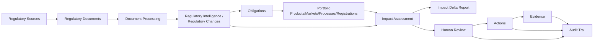

# 02 — System Design and Product Workflow

Evidence: screen inventory in [04](./04-complete-screen-and-component-inventory.md), `api/openapi.json` path list, `src/context/AppContext.tsx`.

## Intended workflow

## Screen-to-workflow mapping (VERIFIED against the screen inventory, not assumed)

| Workflow stage | Frontend screen(s) | Data source |
|---|---|---|
| Regulatory Sources | `api-sources` (`SourcesScreen`) | LIVE |
| Regulatory Documents | `api-documents`, `api-document-detail`, `api-document-upload` | LIVE |
| Document Processing | action inside `api-document-detail` (`useProcessDocument` mutation) | LIVE |
| Regulatory Intelligence / Changes | `api-changes`, `api-change-detail`, `agent-console` (illustrative console) | LIVE (list/detail) + MOCK (console) |
| Obligations | `api-obligations`, obligations shown inline in `api-change-detail` | LIVE |
| Portfolio (Products/Markets/Processes/Registrations/Controls/Authorities) | `api-products`, `api-markets`, `api-processes`, `api-registrations`, `api-controls`, `api-control-detail`, `api-authorities` | LIVE |
| Impact Assessment | `api-impact`, `api-impact-detail`, `api-impact-analyze` | LIVE |
| Impact Delta Report | `api-reports`, `api-report-generate`, `api-report-detail`; also legacy `delta-reports`/`report-detail` | LIVE (api-*) / MOCK (legacy) |
| Human Review | `api-reviews`, `RecordDecisionDialog` | LIVE |
| Actions | `api-actions`, `RaiseActionDialog` | LIVE |
| Evidence | `api-evidence`, `api-evidence-detail`, `AttachEvidenceDialog` | LIVE |
| Audit Trail | `audit` (`AuditTrailScreen`, scoped or global) | LIVE |
| Not in the core workflow, pre-production/illustrative tooling | `feed-monitor`, `haq-drafts`, `variation-drafts`, `validator`, `validation-reports`, `simulator`, `new-change`, `heatmap`, `calendar`, `escalations` | MOCK |

**Key finding:** every named pipeline stage in the user's brief (Sources → Documents → Processing → Intelligence → Changes → Obligations → Portfolio → Impact Assessment → Delta Report → Human Review → Actions → Evidence → Audit) has at least one genuinely live-API screen. The mock-only screens are *adjacent* tooling (drafting assistants, simulators, calendars, a heatmap, an "agent console") layered around that core pipeline, not substitutes for pipeline stages themselves. Having a route/component for a stage does not by itself mean the full intended behavior (e.g. automated change detection, AI drafting) is implemented end-to-end on the backend — only that the frontend's read/write surface for that stage is wired to real endpoints; backend completeness of each capability was not independently audited here.

## User roles and navigation

No role-based UI branching was found in the files read (`AppContext`, `Shell.tsx`) beyond authenticated vs unauthenticated (`Login.tsx` rendered outside the shell). The OpenAPI schema includes `/api/v1/auth/register` and `/api/v1/auth/me`, implying at least organization-scoped accounts, but no distinct "role" screens or permission gates were observed in the frontend route map — this is **UNKNOWN/not verified** rather than confirmed absent, since backend-side role enforcement was out of scope.

## Known gaps between intended workflow and implemented functionality

- "Regulatory Intelligence" has a real list/detail pair (`api-changes`/`api-change-detail`) but also a separate, fully mock "Agent Console" (`agent-console`) that visually implies an autonomous agent monitoring feed — this is illustrative UI only (see [09](./09-known-issues-and-technical-debt.md)).
- Drafting workflows (HAQ drafts, variation drafts, CMC simulator, pre-submission validator) have no live API hooks at all — they are UI concepts, not functioning tools, as of this audit.
- Escalations, Calendar, and Market Heatmap are presentation-only; there's no live escalation-trigger or calendar-event ingestion pipeline visible in the frontend.
